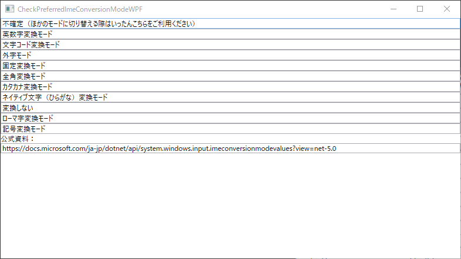

# CheckPreferrdIMEConversionModeWPF

- [Excelのデータの入力規則、半角カタカナにGoogle日本語入力も対応してほしい。 - Gboard コミュニティ](https://support.google.com/gboard/thread/124146622)

Excel 側の不具合の切り分け、Excel がインストールされていない環境での比較用に作成。

## 技術仕様

Visual Studio 2019 で作成したコード

- [ImeConversionModeValues 列挙型 (System.Windows.Input) | Microsoft Docs](https://docs.microsoft.com/ja-jp/dotnet/api/system.windows.input.imeconversionmodevalues?view=net-5.0)

## 検証結果

## IMM 版 Google 日本語入力、Microsoft IME、ATOK での挙動

テキストボックスをクリックすると IME のモードが変わる。

ただし、必ずしも記載のモードにはならない。

外字モードなど IME の機能として存在していないもの、一旦他の変換モードを間に挟むと解消するようになるなどはあるが、ここでは簡易的な検証のため省略する。

## TSF 版 Google 日本語入力の挙動

どのテキストボックスを選択しても入力モードは変更されない。